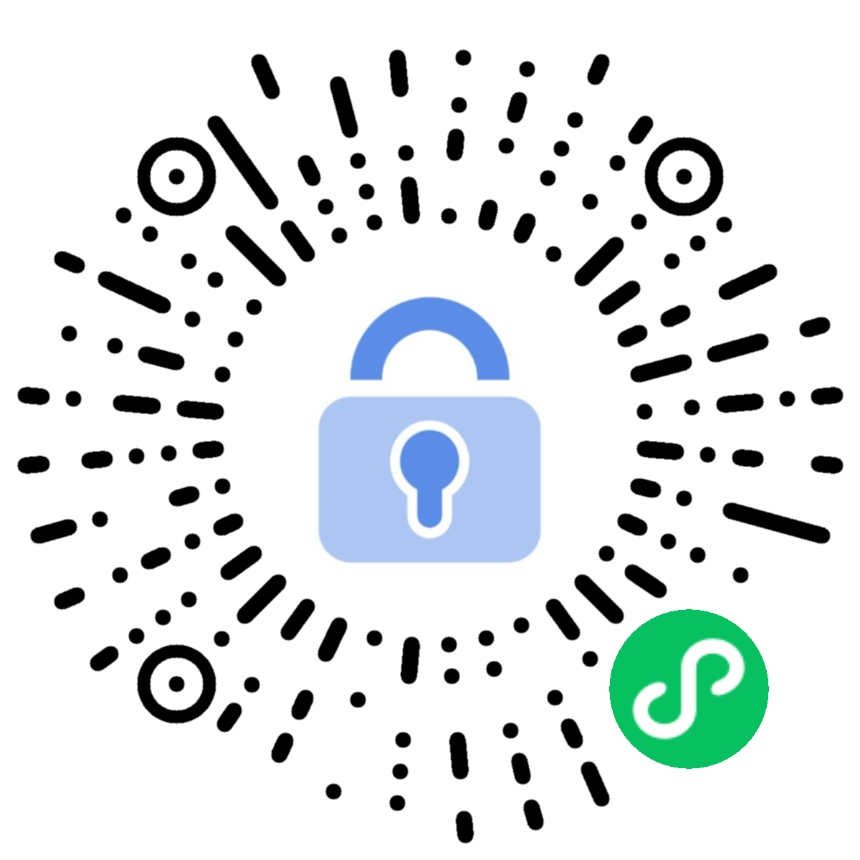

<p align="center">
  
</p>

<h1 align="center">忘记密码管家</h1>

<p align="center">
  一款基于 AES-256 对称加密的本地密码管理微信小程序<br/>
  <strong>所有数据仅存储在你的手机上，不联网、不上传、不追踪</strong>
</p>

<p align="center">
  
  
  
  
  
</p>

---

## 立即体验

打开微信，扫描上方小程序码，即可体验「忘记密码管家」。

> 无需注册，无需登录，打开即用。首次使用只需设置一个 6 位数字 PIN 码。

---

## 为什么选择「忘记密码管家」

| | 传统密码管理 | 忘记密码管家 |
|---|---|---|
| 数据存储 | 云端服务器 | **纯本地存储** |
| 网络依赖 | 需要联网 | **完全离线可用** |
| 注册登录 | 需要账号 | **无需注册** |
| 数据泄露风险 | 服务器被攻击 | **数据不离开你的手机** |
| 加密方式 | 取决于厂商 | **AES-256-CBC，代码完全开源** |

---

## 核心功能

### 密码管理
- 添加、编辑、删除、查看密码条目
- 按网站名称或用户名快速搜索
- 一键复制用户名、密码、网址到剪贴板

### 密码生成器
- 自定义密码长度（6-32 位）
- 可选大写字母、小写字母、数字、特殊符号
- 一键生成并自动填入

### 安全防护
- 6 位 PIN 码保护，支持错误次数限制（5 次）
- 应用切换到后台后自动锁定（可配置 1/5/10/30 分钟或永不）
- 忘记 PIN 码可重置（数据将被清除，无法恢复）

### 算法演示
- 内置交互式加密演示页面
- 实时展示明文 → 加密 → 解密的完整过程
- 错误密钥解密测试，直观感受加密强度

### 数据管理
- 导出加密数据到剪贴板进行备份
- 一键清除所有数据

---

## 加密算法详解

这是本项目的核心，也是你的密码安全的根基。以下完整介绍数据从 PIN 码输入到安全存储的每一步。

### 整体架构

```
┌─────────────────────────────────────────────────────────────┐
│                     用户输入 PIN 码                          │
└─────────────────┬───────────────────────────────────────────┘
                  │
                  ▼
┌─────────────────────────────────────────────────────────────┐
│  ① 生成随机盐值 (Salt)                                      │
│     CryptoJS.lib.WordArray.random(128/8)                    │
│     输出：16 字节随机十六进制字符串                            │
└─────────────────┬───────────────────────────────────────────┘
                  │
          ┌───────┴───────┐
          ▼               ▼
┌──────────────┐  ┌──────────────────────────────────────────┐
│ ② PIN 验证   │  │ ③ 密钥派生                                │
│              │  │                                          │
│ SHA-256      │  │ PBKDF2(PIN, Salt)                        │
│ (PIN + Salt) │  │   - 迭代次数: 10,000                      │
│              │  │   - 密钥长度: 256 bit                      │
│ 输出：哈希值  │  │                                          │
│ (仅用于验证)  │  │ 输出：256 位 AES 加密密钥                  │
└──────────────┘  └────────────────┬─────────────────────────┘
                                   │
                                   ▼
                  ┌──────────────────────────────────────────┐
                  │ ④ AES-256-CBC 加密                       │
                  │                                          │
                  │ 明文(JSON) + 密钥 + 随机IV                │
                  │   → PKCS7 填充                            │
                  │   → CBC 模式分块加密                       │
                  │   → Base64 编码输出                        │
                  │                                          │
                  │ 输出：密文字符串 (存入本地存储)              │
                  └──────────────────────────────────────────┘
```

### Step 1 — 随机盐值生成

```javascript
static generateSalt() {
  return CryptoJS.lib.WordArray.random(128 / 8).toString()
}
```

每次设置 PIN 码时，生成一个 **128 位（16 字节）** 的随机盐值。盐值的作用：

- **相同的 PIN 码 + 不同的盐值 = 完全不同的密钥**，防止彩虹表攻击
- 盐值与加密数据一起存储（盐值本身不是秘密，但与 PIN 结合后才有意义）

### Step 2 — PIN 码哈希验证

```javascript
static hashPin(pin, salt) {
  return CryptoJS.SHA256(pin + salt).toString()
}
```

使用 **SHA-256** 对 `PIN + Salt` 进行哈希运算，生成 256 位摘要值。

- 哈希值用于 **验证 PIN 码是否正确**，而非加密数据
- SHA-256 是单向函数 —— **无法从哈希值反推出 PIN 码**
- 系统只存储哈希值，**永远不存储 PIN 码明文**

### Step 3 — 密钥派生 (PBKDF2)

```javascript
static deriveKey(pin, salt) {
  return CryptoJS.PBKDF2(pin, salt, {
    keySize: 256 / 32,   // 输出 256 位密钥
    iterations: 10000     // 迭代 10,000 次
  }).toString()
}
```

**PBKDF2**（Password-Based Key Derivation Function 2）是专为密码派生设计的算法：

| 参数 | 值 | 说明 |
|------|-----|------|
| 输入 | PIN + Salt | 用户 PIN 码与随机盐值 |
| 迭代次数 | 10,000 | 增加暴力破解成本（每次猜测需 10,000 次运算） |
| 输出长度 | 256 bit | 匹配 AES-256 密钥要求 |
| 底层哈希 | HMAC-SHA1 | CryptoJS PBKDF2 默认使用 |

**为什么不直接用 PIN 码作为密钥？**

6 位数字 PIN 码的组合空间只有 10^6 = 100 万种，直接暴力破解只需毫秒。PBKDF2 通过 10,000 次迭代运算，将每次猜测的计算成本放大数千倍，极大增加了暴力破解的时间成本。

### Step 4 — AES-256-CBC 加密

```javascript
static encrypt(data, key) {
  const encrypted = CryptoJS.AES.encrypt(JSON.stringify(data), key, {
    mode: CryptoJS.mode.CBC,
    padding: CryptoJS.pad.Pkcs7
  })
  return encrypted.toString()   // Base64 编码输出
}
```

**AES-256**（Advanced Encryption Standard）是全球最广泛使用的对称加密标准：

- **密钥长度**：256 位 —— 暴力破解需要尝试 2^256 种可能，宇宙的寿命都不够
- **工作模式**：CBC（Cipher Block Chaining）—— 每个明文块与前一个密文块异或后再加密，同一明文在不同位置产生不同密文
- **填充方式**：PKCS7 —— 标准填充，确保任意长度的明文都能被正确加密
- **初始向量**：CryptoJS 自动生成随机 IV 并嵌入密文头部，确保相同明文每次加密结果不同

### 解密过程

```javascript
static decrypt(encryptedData, key) {
  const decrypted = CryptoJS.AES.decrypt(encryptedData, key, {
    mode: CryptoJS.mode.CBC,
    padding: CryptoJS.pad.Pkcs7
  })
  return JSON.parse(decrypted.toString(CryptoJS.enc.Utf8))
}
```

解密是加密的逆过程 —— **只有持有正确 PIN 码（进而派生出正确密钥）的人才能解密数据**。错误密钥解密得到的是乱码或空值，无法获取任何有意义的信息。

### 本地存储结构

```javascript
{
  "pin_hash":       "a3f2...8b1c",   // SHA-256(PIN + Salt)，仅用于验证
  "salt":           "7e4d...f1a9",   // 128 位随机盐值
  "encrypted_data": "U2Fsd...Q==",   // AES-256-CBC 加密的密码数据 (Base64)
  "settings": {                      // 应用设置（不加密）
    "auto_lock": 300,
    "theme": "light"
  }
}
```

### 安全性总结

| 防护层 | 技术 | 作用 |
|--------|------|------|
| PIN 码验证 | SHA-256 | 单向哈希，无法逆推 PIN 码 |
| 密钥派生 | PBKDF2 (10,000 iterations) | 放大暴力破解计算成本 |
| 数据加密 | AES-256-CBC + PKCS7 | 军事级别的对称加密标准 |
| 随机盐值 | 128 位随机数 | 防止彩虹表攻击 |
| 随机 IV | 每次加密自动生成 | 相同明文产生不同密文 |
| 数据隔离 | 纯本地存储 | 数据不离开设备，无网络攻击面 |

---

## 项目结构

```
PwdManager/
├── app.js                          # 应用入口（PIN 检查、自动锁定）
├── app.json                        # 应用配置（页面路由、tabBar）
├── app.wxss                        # 全局样式
├── custom-tab-bar/                 # 自定义底部导航栏
│   ├── index.js
│   ├── index.wxml
│   ├── index.wxss
│   └── index.json
├── pages/
│   ├── pin-setup/                  # PIN 码设置页面
│   ├── pin-verify/                 # PIN 码验证页面
│   ├── password-list/              # 密码列表页面 (Tab)
│   ├── password-detail/            # 密码详情页面
│   ├── password-edit/              # 密码编辑/新增页面
│   ├── crypto-demo/                # 加密算法演示页面 (Tab)
│   └── settings/                   # 设置页面
├── utils/
│   ├── crypto.js                   # 加密工具类 (AES-256 / PBKDF2 / SHA-256)
│   └── storage.js                  # 本地存储管理类
├── components/
│   └── custom-navbar/              # 自定义导航栏组件
├── miniprogram_npm/
│   ├── crypto-js/                  # CryptoJS 加密库
│   └── tdesign-miniprogram/        # TDesign UI 组件库
├── qrcode.jpg                      # 小程序码（扫码体验）
└── package.json
```

---

## 本地开发

### 环境要求

- [微信开发者工具](https://developers.weixin.qq.com/miniprogram/dev/devtools/download.html)（稳定版）
- Node.js 14+

### 安装步骤

```bash
# 1. 克隆项目
git clone https://github.com/your-username/PwdManager.git
cd PwdManager

# 2. 安装依赖
npm install

# 3. 在微信开发者工具中打开项目目录

# 4. 在开发者工具中构建 npm 包
#    菜单栏 → 工具 → 构建 npm

# 5. 编译运行
```

### 技术栈

| 技术 | 用途 |
|------|------|
| 微信小程序原生框架 | 应用框架 |
| [TDesign 小程序组件库](https://tdesign.tencent.com/miniprogram) | UI 组件 |
| [CryptoJS](https://github.com/brix/crypto-js) | 加密算法（AES / PBKDF2 / SHA-256） |
| JavaScript ES6+ | 开发语言 |

---

## 使用指南

### 首次使用

1. 微信扫描上方小程序码，或在微信搜索「忘记密码管家」
2. 设置 6 位数字 PIN 码（请牢记，无法找回）
3. 确认 PIN 码后自动进入密码管理页面

### 日常使用

1. 打开小程序，输入 PIN 码解锁
2. 点击右下角 `+` 按钮添加密码条目
3. 点击列表中的条目查看详情，支持一键复制
4. 底部导航栏切换到「算法演示」，亲眼见证加密过程

### 安全建议

- **牢记 PIN 码** —— 忘记 PIN 码将导致所有数据无法恢复
- **定期备份** —— 在设置页面导出加密数据，妥善保管
- **及时更新** —— 关注项目更新，获取安全修复

---

## 常见问题

**Q: 忘记 PIN 码怎么办？**
> PIN 码是解密数据的唯一凭证。忘记后只能重置应用（所有数据将被清除），无法恢复已保存的密码。

**Q: 数据存在哪里？**
> 所有数据存储在微信小程序的本地 Storage 中，仅在你的设备上，不会上传到任何服务器。

**Q: 换手机后数据还在吗？**
> 微信小程序的本地数据不会随微信账号迁移。建议在换机前通过「设置 → 导出数据」备份。

**Q: AES-256 安全吗？**
> AES-256 是美国政府批准的机密级加密标准，被全球银行、军事、政府机构广泛采用。暴力破解 AES-256 需要的时间超过宇宙的年龄。

**Q: 算法演示页面是真实的加密过程吗？**
> 是的。演示页面调用的是与数据保护完全相同的加密函数（`crypto.js`），所见即所得。

---

## 开源协议

本项目基于 [MIT License](./LICENSE) 开源。

---

<p align="center">
  <strong>扫码体验「忘记密码管家」</strong><br/><br/>
  <br/><br/>
  你的密码，只属于你。
</p>
